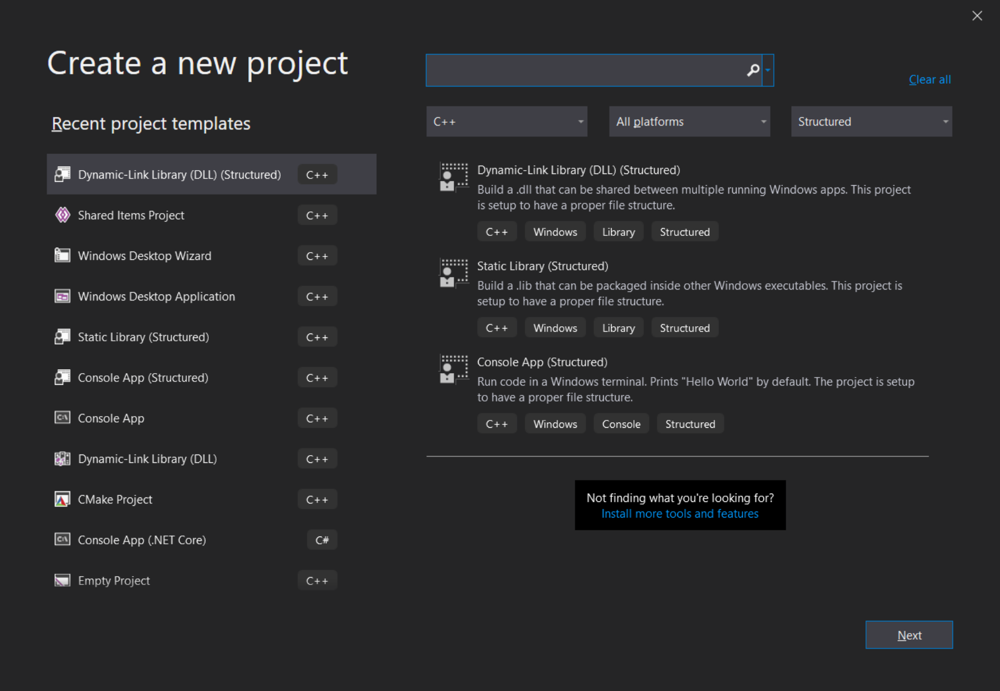

## Visual Studio C/C++ Project Structure

An example of a better way to structure your C/C++ code with Visual Studio. Utilizes physical folders over Visual Studio's filters.

## Structured Overview

The design of this structure has been made to be as intuitive as possible. Things should live where you expect them to.

- Output directory is `$(SolutionDir)bin\$(ProjectName)\$(Configuration)\$(Platform)`
  - This makes it very easy to know where an `exe`, `dll`, or `lib` lives.
- Including internal project headers is as simple as `$(SolutionDir)<some project name>\inc`
- Adding a `static library` as a dependency is `$(SolutionDir)bin\<some project name>\$(Configuration)\$(Platform)\<some project name>.lib`
- The Visual Studio solution also includes a `pkg` folder as a way to maintain internal libraries. Read the [Notes](#notes) at the bottom to understand why we call it `pkg`.

## Getting Started

### Running hello.exe

Build the solution and place `bar's` compiled DLL into the same directory as `hello's`.

Example:

- Build the solution in `Debug` mode with `x86`
- Copy `bar.dll` from `bin\bar\Debug\Win32\bar.dll`
- Paste `bar.dll` to `bin\hello\Debug\Win32\`

### Install Templates

- Place the all the files located in the `templates` directory inside `%USERPROFILE%\Documents\Visual Studio <version>\Templates\ProjectTemplates\Visual C++ Project`
- Restart `Visual Studio`
- Now create a new project
- In the new project view, change your filters to `C++` and the project type to `Structured`



### Enabling Structured View

In order to disable Visual Studio's filters and use the physical files located on your drive, you must enable the `Show All Files` option for every project.

You'll need to do this `every time` you create a `new structured project`.


### Include a Static Library Inside a Project

- Create a new `Static Library (Structured)` project
  - Optionally you can create the new project under `pkg`
- Right click on the project you wish to add the static library to and go to `Add` and then `Reference`. Select the static library project you wish to include
  - This is required to make sure we always compile the static library if we need to (when building our main application)
- Right click on your main project where you wish to include a static library in and select `Properties`
- Under `C/C++`, open up the `General` view. In the `Additional Include Directories` row, add `$(SolutionDir)<static library name>\inc`
  - This is making our header files visible to our main project
  - e.g., `$(SolutionDir)foo\inc`
- Under `Linker`, open up the `Input` view. In the `Additional Dependencies`, add `$(SolutionDir)bin\<static library name>\$(Configuration)\$(Platform)\<static library name>.lib`
  - This will link the implementation of the static library
  - e.g., `$(SolutionDir)bin\foo\$(Configuration)\$(Platform)\foo.lib`
- You should now be able to include the static library header and use it inside your application

Example:

```cpp
#include "pch/pch.h"
#include <foo/bar.h>

int main()
{
  foo::Bar();
}
```

## Notes

`pkg` is an abbreviation for package. Package, library, or dependency is all used interchangeably. Feel free to rename `pkg` to what you like best.
